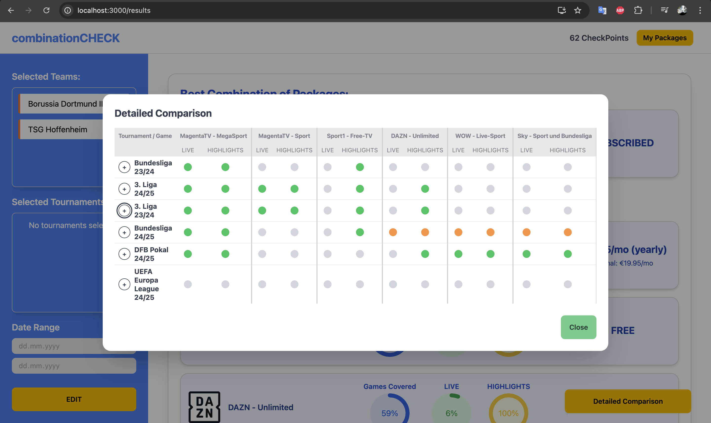
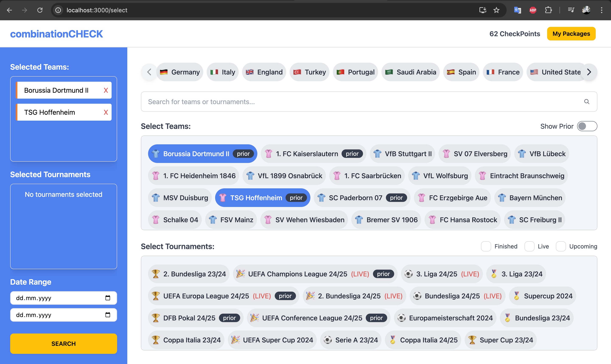
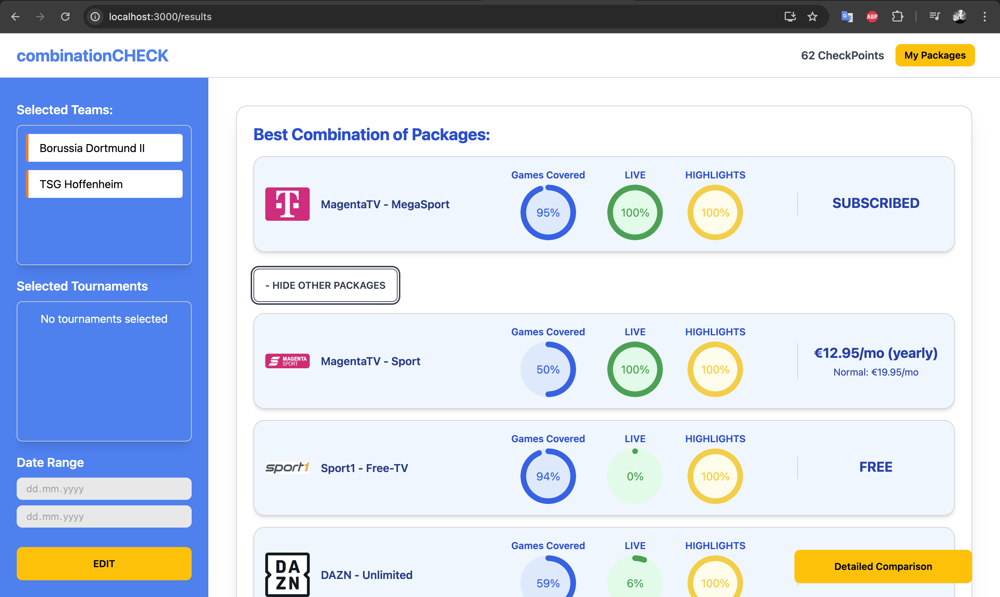

# STREAM COMBINATIONS

<div align="center">
  
  
  
</div>


## Table of Contents
- [Introduction](#introduction)
- [Features](#features)
- [Technologies Used](#technologies-used)
- [Installation](#installation)
- [Usage](#usage)
- [Algorithm Overview](#algorithm-overview)
  - [Precaching](#precaching)
  - [OR-Tools Solver](#or-tools-solver)
  - [Greedy Algorithm](#greedy-algorithm)
- [Payment Integration](#payment-integration)
- [Data Processing](#data-processing)
- [Challenges Faced](#challenges-faced)

## Introduction

Welcome to **STREAM COMBINATIONS**! This application was developed as part of the [Check24 GenDev24 Challenge](#challenge-description). It finds the best combination of streaming packages for specific football teams or tournaments.

## Features

- **Fast Performance:** Search algorithms with precaching.
- **Team Selection:** Choose one or multiple teams and tournaments to track the matches.
- **Optimal Combination Finder:** Best combination of packages to cover all selected games at the lowest total price.
- **Date Range Search:** Use date ranges - it will handle both monthly and yearly subscriptions appropriately.
- **Payment Integration:** Purchase streaming packages directly within the application, managing user balances and package costs.
- **User-Friendly Interface:** Design was inspired by Check24's mobile app, built using React, TypeScript, and daisyUI with TailwindCSS.

## Technologies Used

### Backend
- **Java 21:** 
- **Spring Boot:** 
- **Google OR-Tools:** 

### Frontend
- **React with TypeScript:** 
- **React Router:** 
- **daisyUI & TailwindCSS:** 

### DevOps
- **Docker & Docker Compose:** 

## Installation

### Prerequisites
- **Docker:** Ensure you have Docker installed on your machine.

### Steps
1. **Clone the Repository:**
    ```bash
    git clone https://github.com/yourusername/streaming-package-comparator.git
    ```
2. **Navigate to the Project Directory:**
    ```bash
    cd stream-combinations
    ```
3. **Run the Application with Docker Compose:**
    ```bash
    docker-compose up
    ```
4. **Access the Application:**
    Open your browser and navigate to `http://localhost:3000`

## Usage

1. **Select Teams:**
   - Choose one or multiple football teams from the selection page.
2. **View Package Comparison:**
   - The application will display a ranked list of streaming packages based on the availability of the selected teams' matches.
3. **Optimal Package Combination:**
   - If no single package covers all matches, the system will suggest the best combination of packages to cover all games at the lowest cost.
4. **Manage Subscriptions:**
   - Use the payment feature to purchase streaming packages directly. Purchased packages are handled as free in subsequent searches.

## Algorithm Overview

### Precaching

I use **precaching** mechanism from Java Spring Boot. Each search query is stored in the cache. Before executing a new search, the system checks if the exact query has been processed before. 

### OR-Tools Solver

The core of the search functionality leverages **Google OR-Tools**.

**Why OR-Tools?**

Compared to other methods like greedy algorith, OR-Tools ensures faster and more reliable optimization results.

### Greedy Algorithm

After determining the best combination using OR-Tools, a **greedy algorithm** ranks the remaining packages. This approach is chosen for its simplicity and speed. While it may not always find the optimal ranking, the minor inaccuracies are acceptable for presenting additional options to users.

## Payment Integration

This feature demonstrates the algorithm's flexibility in handling packages with varying costs and ownership statuses.

## Data Processing

I created multiple HashMaps for games, streaming offers, and packages to ensure fast data retrieval during searches.
I also mplemented a separate CSV file to allow users to select their country, dynamically displaying relevant teams and tournaments.

## Challenges Faced

1. Understanding OR-Tools:
2. The datasets included many games without streaming offers, leading to error.
3. It was hard to understand if my algorithm is actually working correct, without a frontend to visualize search results in real-time.
4. Finding the right balance between covering all games and minimizing costs required extensive experimentation with algorithm parameters.


**Challenge Description:**

*For detailed information about the challenge, refer to the [Check24 GenDev24 Challenge](#).*

